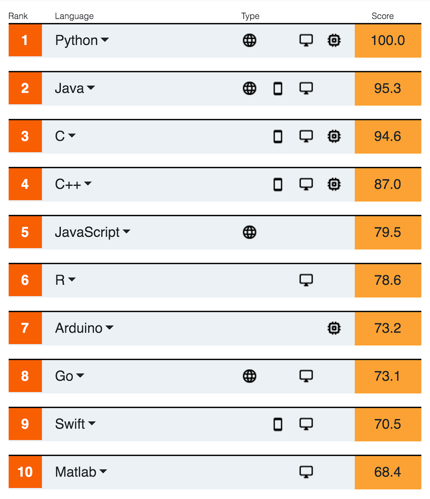

class: inverse, center, middle
background-image: url(https://live.staticflickr.com/2834/10119341476_e3a831e967_k.jpg)
background-size: cover

### 中華民國地球物理學會與中華民國地質學會<br/>109年年會暨學術研討會-R程式語言介紹

<br/>
<br/>
<br/>
<br/>

# R程式語言之地科應用


.large[林柏伸 | 財團法人中興工程顧問社防災科技研究中心 | 17 Nov 2020]
---

# 學習R的理由

--

- 免錢(Free)

--

- 開放原始碼(Open Source)

--

- 跨平台，可以跑在Windows、Mac、Linux

--

- 搭上現在最夯的話題：Data Science、Big data...

當然，你也可以學JAVA、C、Python...但我個人用R，所以我首推R (Python次之)。

--

- 用RStudio寫R很爽～～～

.center[]

--

當然，RStudio也是免錢+開放原始碼

---

# 2020程式語言的排名

.pull-left[

#### TIOBE (Top 9!)

<a href="https://www.tiobe.com/tiobe-index/"></a>

]


.pull-right[

#### IEEE Spectrum (Top 6!)



]
---

# R的相關網頁
- [官方網頁https://www.r-project.org/](https://www.r-project.org/) 直接google "r"第一個結果就是!
- [RStudio](https://www.rstudio.com/) 寫R必備的IDE工具，找不到更好的了！
    - [rmarkdown](http://rmarkdown.rstudio.com/) R寫文件
    - [shiny](http://shiny.rstudio.com/) RStudio開發出來的架構，可以用R開發網頁應用。
    - [Rpubs](https://rpubs.com/) 用R寫出來的文件可以丟到上面分享。
- [RDocumentation](http://www.rdocumentation.org/) 搜尋R package & function 的好地方！！
- [R Weekly](https://rweekly.org/) R週報，吸收R新知的地方！(__推推！__)
- [R-blogger](https://www.r-bloggers.com/) 另一個吸收R新知的地方
- [Awesome R](https://awesome-r.com/) A curated list of awesome R packages and tools.

---

# 哪些研究單位使用R？

.pull-left[
USGS使用R

- [USGS-R 社群網頁](https://owi.usgs.gov/R/)
- [USGS-R Github](https://github.com/USGS-R)

<a href="https://owi.usgs.gov/R/"></a>
]

.pull-right[
<a href="https://www.nhs.uk/">NHS</a>使用R

- [NHS-R 社群網頁](https://nhsrcommunity.com/)

<a href="https://nhsrcommunity.com/"></a>
]


]

---

# 台灣的R社群

- [Taiwan R User Group/MLDM Monday](https://www.meetup.com/Taiwan-R/)


- [R-LADIES TAIPEI](https://rladiestaipei.github.io/R-Ladies-Taipei/)


---

# 如何學習R

- [Yongfu's Blog-我的R學習歷程](https://yongfu.name/2018/01/31/RlearningPath.html)

- [長庚大學資訊管理學系-曾意儒-資料科學與R語言](https://yijutseng.github.io/DataScienceRBook/)

- [國立臺北大學統計學系-吳漢銘-R軟體教學/R語言程式設計](http://www.hmwu.idv.tw/index.php/r-software)

- [郭耀仁- 輕鬆學習R語言](https://yaojenkuo.gitbooks.io/learn-r-the-easy-way/content/)

- [R語言翻轉教室-全中文R語言互動式教材](https://datascienceandr.org/index.html)

- [R Class for Seismologists](http://mazamascience.com/Classes/IRIS_2015/)

- [Earth Analytics Course: Learn Data Science](https://www.earthdatascience.org/courses/earth-analytics/)

---

# 學習R的管道

- [Coursera線上課程](https://www.coursera.org/)

    英文發音但是有中文字幕！重點是不只有R的課程可以學，還有各式各樣的課程可以學習，連台大都有老師把課程放上去。(極推！)
    
- [stackoverflow](http://stackoverflow.com/questions/tagged/r)

    寫程式的時候遇到問題都可以來這裡找答案！

---

# 進階了解R

- [Advanced R](http://adv-r.had.co.nz/) 

    R的神級高手Hadley Wickham[(個人網頁)](http://hadley.nz/)寫的，他目前在RStudio服務，寫了很多很厲害的package，如果可以把他寫的package都搞熟了，那差不多可以是半個神人了。

- [The tidyverse](http://tidyverse.org/) 

<a href="http://dplyr.tidyverse.org"></a><a href="http://forcats.tidyverse.org"></a><a href="http://ggplot2.tidyverse.org"></a><a href="http://haven.tidyverse.org"></a><a href="http://lubridate.tidyverse.org"></a><a href="http://magrittr.tidyverse.org"></a><a href="http://purrr.tidyverse.org"></a><a href="http://readr.tidyverse.org"></a><a href="http://readxl.tidyverse.org"></a><a href="http://stringr.tidyverse.org"></a><a href="http://tibble.tidyverse.org"></a><a href="http://tidyr.tidyverse.org"></a><a href="http://tidyverse.tidyverse.org"></a>

---
class: inverse, middle, center

# 讓我們來看看R的擴充套件

---

# R packages 套件列表

目前R共有 __16573__ 個套件在CRAN套件庫

- [按照套件名稱排序的列表](https://cran.r-project.org/web/packages/available_packages_by_name.html)
- [按照主題分類的套件列表](https://cran.r-project.org/web/views/)
    - [化學計量學與計算物理學 Chemometrics and Computational Physics](https://cran.r-project.org/web/views/ChemPhys.html)
    - [水文學 Hydrology](https://cran.r-project.org/web/views/Hydrology.html)
    - [空間分析 Analysis of Spatial Data](https://cran.r-project.org/web/views/Spatial.html)
    - [時空資料分析 Spatio-Temporal](https://cran.r-project.org/web/views/SpatioTemporal.html)
    - [時序分析 Time Series Analysis](https://cran.r-project.org/web/views/TimeSeries.html)

---

# R地科相關應用套件

- [Introduction to R for the Geosciences](http://www.fromthebottomoftheheap.net/teaching/courses/mcmaster_2013/mcmaster_2013.html)

- [使用R來做地震分析 Convert to R for Seismic Analysis.pdf](http://www.unc.edu/~leesj/FETCH/GRAB/Vignettes/whyRbeam.pdf)

- [Statistical Seismology Library](http://homepages.maxnet.co.nz/davidharte/SSLib/) 地震統計學

- [ETAS (Modeling earthquake data using Epidemic Type Aftershock Sequence model](http://cran.r-project.org/web/packages/ETAS/index.html)

- [GRTo: Tools for the analysis of Gutenberg-Richter distributions of earthquake magnitudes](http://cran.r-project.org/web/packages/GRTo/index.html)

- [RCTC: “R” Package for Computation of Earthquake Ground-Motion Response Spectra](https://peer.berkeley.edu/news/new-peer-report-201709-%E2%80%9Cr%E2%80%9D-package-computation-earthquake-ground-motion-response-spectra)

- [Geochemical Data Toolkit (GCDkit)](http://www.gcdkit.org/)

---

# 地震相關套件

- [IRISSeismic: Classes and Methods for Seismic Data Analysis](https://cran.r-project.org/package=IRISSeismic)

- [RSEIS: Seismic Time Series Analysis Tools](https://cran.r-project.org/package=RSEIS)

- [eseis: Environmental Seismology Toolbox](https://cran.r-project.org/package=eseis)

---

# 特別介紹
- Jonathan M. Lees
- Professor, Department Chair, Department of Geological Sciences, University of North Carolina at Chapel Hill
- [個人網頁https://leesj.sites.oasis.unc.edu/](https://leesj.sites.oasis.unc.edu/)
- 開發的套件
    - RSEIS:Seismic Analysis, Time Series
    - GEOmap:Geological Mapping, GIS
    - ProfessR:Create Exams, Grading
    - RFOC:Focal Mechanisms, statistics on a sphere
    - RPMG:Really Poor Man's GUI
    - zoeppritz:scattering at an interface
    - RTOMO:visualization of tomographic inversions 

---

# 使用R進行GIS分析

使用R進行GIS分析可參考電子書：

- [Geocomputation with R](https://bookdown.org/robinlovelace/geocompr/)

- [Geodesic geometry](https://mgimond.github.io/Spatial/)

[r-spatial.org](https://www.r-spatial.org/) is a website and blog for those interested in using R to analyse spatial or spatio-temporal data.

---

# R的語法

隨機取常態分佈N(0,1)的10個數。
```{r}
rnorm(10)
```

---

# R內建的範例資料

鳶尾花的資料集

```{r iris}
data(iris) #載入資料
head(iris) #查看最前面6行資料
```

---

# R繪圖

隨機取常態分佈N(0,1)的1000個數，然後畫直方圖(histogram)。

```{r hist, fig.height=4, dev='svg'}
x <- rnorm(1000,0,1)
hist(x)
```

---

# R繪圖

使用內建的cars資料集繪圖

```{r cars-plot1, fig.height=4, dev='svg'}
par(mar = c(4, 4, 1, .1))
plot(cars, pch = 19, col = 'darkgray', las = 1)

```

---

# R繪圖

加上一條回歸線

```{r cars-plot2, fig.height=4, dev='svg'}
plot(cars, pch = 19, col = 'darkgray', las = 1)
fit = lm(dist ~ 1 + speed, data = cars)   # simple regression
abline(fit, lwd = 2)                      # add a regression line
```

---

# R繪圖

用R畫鳶尾花的數據集(多變量)
```{r iris-plot, fig.height=4, dev='svg'}
plot(iris) #畫圖
```

---
class: inverse, middle, center

# 來產製表格


---

# 表格

```{r}

knitr::kable(head(iris), format = 'html')

```


---

# 動態表格

```{r}
DT::datatable(
  head(iris, 10),
  fillContainer = FALSE, options = list(pageLength = 6)
)

```

---
class: inverse, middle, center

# 來畫地圖

---

# 畫世界地圖

```{r sf, fig.height=6, warning=FALSE, message=FALSE}
library(sf)
library(spData)
ggplot(data = world) + geom_sf()
```

---

# 使用google底圖
```{r ggmap, fig.height=6, warning=FALSE, message=FALSE}
library(ggmap)
gm = get_map(location=c(121.25,24.9,121.8,25.3))
ggmap(gm)
```

---

# 互動式地圖

```{r out.width='100%', fig.height=6, eval=require('leaflet'), warning=FALSE, message=FALSE}
library(leaflet)
leaflet() %>% addTiles() %>% setView(121.560642, 25.043826, zoom = 17)
```

---

# 用R Markdown來產製你的分析成果

<a href="https://rmarkdown.rstudio.com/"></a>

R Markdown = R + Markdown

因為HTML有點太複雜了，所以誕生了Markdown，讓文件撰寫更容易。R內含一個叫"sweave"的系統(使用[LaTeX](https://zh.wikipedia.org/zh-tw/LaTeX)排版系統)，可以產生動態文件。後來[謝益輝博士](https://yihui.org/)開發了[knitr](https://yihui.org/knitr/)這個套件，讓R產生動態文件的方便性大增，可以把R程式碼跟文件完美的結合在一起。

---

# R Markdown運作原理

Rmd -> 經過knitr套件編譯 -> md -> 再經過萬能[pandoc](https://pandoc.org/)編譯 -> 變成你要的文件格式


---

# R Markdown支援的格式

[RStudio Formats](https://rmarkdown.rstudio.com/formats.html)

```{r, echo=FALSE, out.width = "700px", dpi=300}

```

---
# R還可以...

.pull-left[
- 使用[Shiny](https://shiny.rstudio.com/)建立數據的[互動式圖表](https://shiny.rstudio.com/gallery/): [Nepal quake](https://asheshwor.shinyapps.io/np-quake/)

- [devtools](https://www.rstudio.com/products/rpackages/devtools/)開發R語言套件pacakge: [GMPEhaz](https://github.com/personlin/GMPEhaz)

- [bookdown](https://bookdown.org/yihui/bookdown/)撰寫電子書
]

.pull-right[
-  [thesisdown](https://github.com/ismayc/thesisdown)寫學位論文

- [blogdown](https://bookdown.org/yihui/blogdown/)建立個人blog:[Prof. Yi-Ju Tseng](https://yjtseng.info/)

]
---
class: center, middle

# 希望大家會開始使用R語言

## 從今天開始!!

---
class: center, middle

# 謝謝！Thanks!

<https://forms.gle/HkVcAkgPG6TXMDrA9>

## 課後問卷 


Slides created via the R package xaringan.


---

# 歡迎加入R語言與地球科學

.pull-left[

## FB粉絲專頁


]

.pull-right[

## Twitter


]

